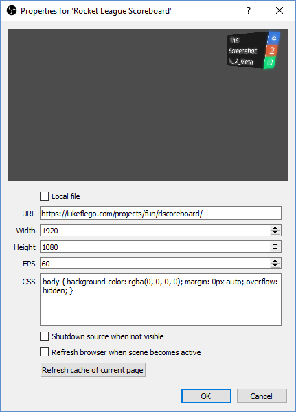

# rlscoreboard
## A Rocket League style scoreboard

Useful for keeping track of matches/games. Originally created for JohnnyBoi_i to rid his "pixel-perfect misplays".

### How to install

- Add the URL as a browser source in your streaming software
- Make the browser source width and height match your stream output
- Ignore if you don't want to use the perspective feature of the design
- Example OBS properties  

### How to use
- Increase score by clicking top half of score
- Decrease score by clicking bottom half of score
- Change team/player colour by clicking on row
- Change team/player name by clicking on row
- Add new teams/players by pressing enter
- Clear the row text to remove row

### Useful CSS (transparent background)
    body { background-color: transparent; margin: 0px auto; overflow: hidden; }

> **Only tested with OBS - BrowserSource.**  
I see no reason why this wouldn't work with other streaming softwares.
